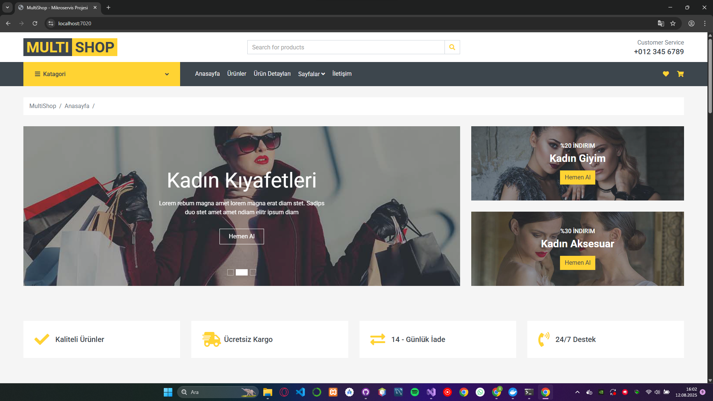
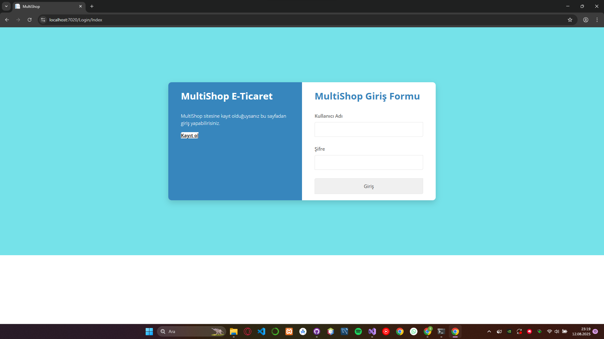

# 🛒 Multishop E-Ticaret Platformu

ASP.NET Core, IdentityServer4 ve çok katmanlı mimari ile geliştirilmiş modern e-ticaret platformu.  
Farklı kullanıcı rolleri (Admin, Manager, Visitor) için yetkilendirme, token tabanlı güvenlik, ürün yönetimi ve sipariş takibi özellikleri sunar.




---

## 🚀 Özellikler
- 🔑 Kullanıcı rolleri (Admin, Manager, Visitor)
- 🔐 IdentityServer4 ile kimlik doğrulama ve yetkilendirme
- 🛡 JWT token tabanlı güvenlik
- 📦 Ürün ekleme, güncelleme, silme
- 🛍 Sepet yönetimi ve sipariş takibi
- 📱 Mobil uyumlu (Responsive) tasarım
- ⚡ Hızlı ve optimize edilmiş sorgular

---

## 🛠 Kullanılan Teknolojiler
### Backend
- ASP.NET Core
- C#
- Entity Framework Core
- Dapper
- IdentityServer4
- Redis (Cache)

### Frontend
- HTML, CSS, Bootstrap
- Razor Pages
- Vue.js

### Veritabanı
- SQL Server
- Redis
- PostgreSQL
- MSSQL
- MongoDb

### Araçlar
- Git, GitHub
- Docker
- Postman
- Swagger
- DBeaver

---

## 📦 Kurulum
```bash
# Depoyu klonla
git clone https://github.com/kullaniciadi/multishop.git

# Proje klasörüne gir
cd multishop

# Bağımlılıkları yükle
dotnet restore

# Projeyi çalıştır
dotnet run
